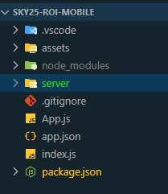
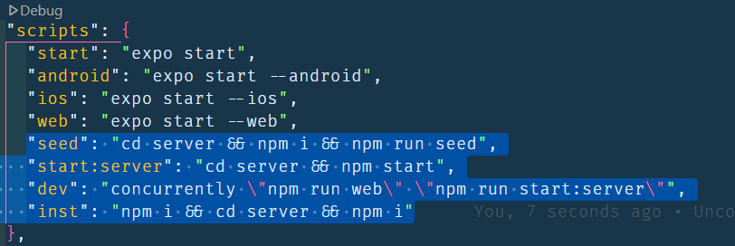
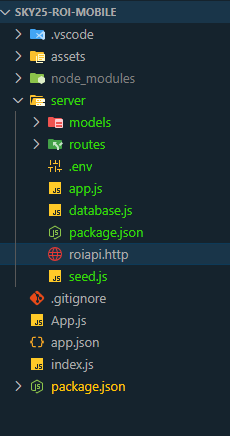
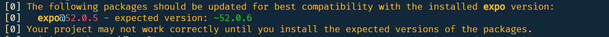

# Configure the server

1. Download [server](./assets/server.zip) zip file into the project folder
2. Extract it, so you should find a `server` folder into your project folder



3. This folder contain the api code to be used in your mobile app
4. Update `package.json` by adding the following lines to **scripts**

```json
    ,"seed": "cd server && npm i && npm run seed",
    "start:server": "cd server && npm start",
    "dev": "concurrently \"npm run web\" \"npm run start:server\"",
    "inst": "npm i && cd server && npm i"
```



5. Run `npm run seed` to install server' packages and seed the database
6. Run `npm run dev` to test your application, at this moment you have 2 running projects, the `server` and your `app`
7. You can use `roiapi.http` from the `server` folder to test the API



8. If encounter upgrade request to the expo SDK, please run the following command:

```bash
npm install expo@latest
```



> Stage and commit "Add dependencies and the api server"
