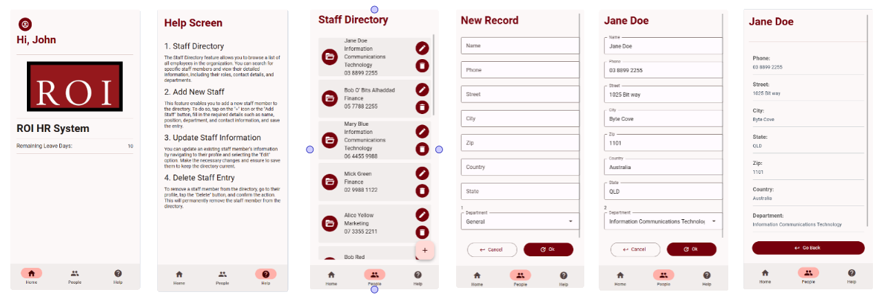

# Create the Screens

- Create Screens files in screens folder for `Home`, `Help`, `Not found`, `New & Edit`, `View`, and `Staff Directory` (6 screens)

```bash
|- screens
    |- HomeScreen.js
    |- HelpScreen.js
    |- NotFoundScreen.js
    |- PeopleViewScreen.js
    |- PersonViewScreen.js
    |- PersonEditScreen.js
```

- Write the basic screens layout

## Snippets

| **Prefix** | **Name** | **Description** |
|---|---|---|
| jh-ps | Paper Screen | Creates a basic screen using React Native Paper library with a centered title. |

