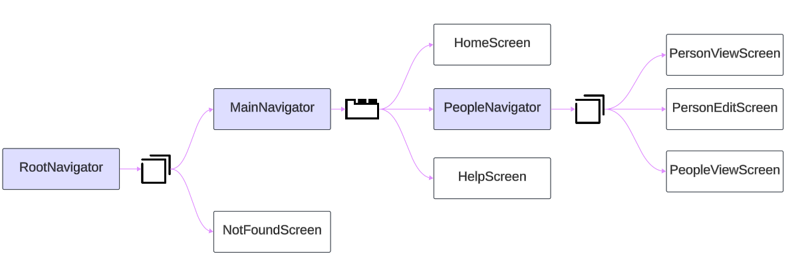

# Create the navigators

- Create 3 files for your navigators, `Root`, `Main`, `People` (or any name you like `Staff`, `Employees`) under navigation folder

- **Note the type of each navigator**
- **Do not Forget to import used screens in navigators**
- **Icon name in small letter**
- **Make icon size 26**
- **Use** [Expo Vector Icons](https://icons.expo.fyi/Index) **to select font name**
- **MaterialCommunityIcons is the filter to select the icons**

```bash
|- navigation
    |- RootNavigator.js     [Stack Navigator]
    |- MainNavigator.js     [Tab Navigator]
    |- PeopleNavigator.js   [Stack Navigator]
```

## Code The Navigators

- `MainNavigator` is first child in `RootNavigator`
- `PeopleNavigator` is the second child in `MainNavigator` where `HomeScreen` is the first, and `HelpScreen` is the last
- Import all required screens and navigators
- `component` value is the screen file name **without extension**
- `name` attribute is the ID of the screen that can be used in navigation



### Map screens to navigators as following:

```bash
|- navigation
    |- RootNavigator.js (Stack Navigator)
      |- MainNavigator.js (Tab Navigator)
          |- HomeScreen.js
          |- PeopleNavigator.js (Stack Navigator)
              |- PeopleViewScreen.js
              |- PersonViewScreen.js
              |- PersonEditScreen.js
          |- HelpScreen.js
      |- NotFoundScreen.js
```

- **RootNavigator = Stack Navigator**
  - Screen name="Main" = MainNavigator
  - Screen name="NotFound" = NotFoundScreen
- **MainNavigator = Tab Navigator**
  - Screen name='Home' = HomeScreen
  - Screen name='People' = PeopleNavigator
  - Screen name='Help' = HelpScreen
- **PeopleNavigator = Stack Navigator**
  - Screen name="PeopleView" = PeopleViewScreen
  - Screen name="PersonView" = PersonViewScreen
  - Screen name="PersonEdit" = PersonEditScreen

## Snippets

| **Prefix** | **Name** | **Description** |
|---|---|---|
| jh-rnsn | RN Stack-Navigator | Sets up a React Navigation stack navigator with options for initial route and custom screen names. |
| jh-rntn | RN Tab-Navigator | Sets up a React Navigation tab navigator with options for tab labels and icons. |

> Stage and commit "Add screens and navigators with basic layout"
