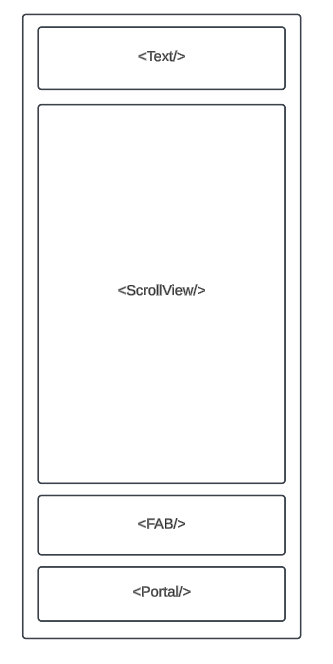
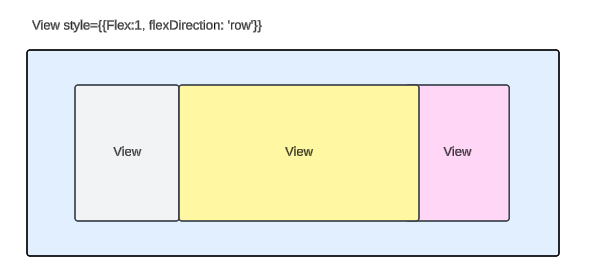
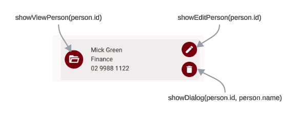
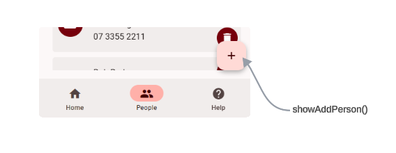
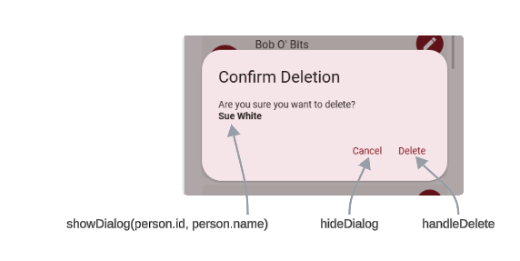

# Implement UI

## 1. In PeopleViewScreen

### 1.1 Preparation

- Import `useTheme` from `react-native-paper`, and grab the theme variable in this component
  - `theme = useTheme();`
- Import `useIsFocused` from `@react-navigation/native`,
  - grab `const isFocused = useIsFocused();`
  - use it in the `useEffect` dependencies.

```javascript
useEffect(() => {
  fetchData();
}, [isFocused]);
```

- Data and functions elements used in the screen

| Element                              | Type     | Purpose                                                                   |
| ------------------------------------ | -------- | ------------------------------------------------------------------------- |
| `person.name`                        | content  | in the card content                                                       |
| `person.Department.name`             | content  | in the card content                                                       |
| `person.phone`                       | content  | in the card content                                                       |
| `showViewPerson(person.id)`          | function | uses it with the avatar to show the view screen                           |
| `showEditPerson(person.id)`          | function | use it in card, icon button to show edit of the current record            |
| `showDialog(person.id, person.name)` | function | use it in card, icon button to show dialog with person name before delete |
| `showAddPerson()`                    | function | use it in FAB to show the add new screen                                  |
| `hideDialog`                         | function | use it in Portal Dialog                                                   |
| `handleDelete`                       | function | use it in Portal Dialog                                                   |

### 1.2 Screen' Design

- Erase all staff from the return JSX except the root `<Surface/>` or `<View/>`
- Make sure the root Surface of View has `style={{ flex: 1, padding: 16 }}`
- Add `<Text/>` component as headline with text like `Staff Directory` styled `variant="headlineLarge"`
- Add `<ScrollView/>` component with `style={{ flex: 1 }}`
- Implement the card as shown alter
- Implement `<FAB/>` after `<ScrollView/>`
- Implement `<Portal>` after `<FAB/>`



### 1.3 Implement the Card

- Map the people array to a card of the following design:



- First View for the **avatar**, second for **main content**, and last on the right for the **buttons** as following:



- Use `TouchableOpacity` with `Avatar.Icon` component to create the avatar icon that will serve to open the view screen using the previously created function `showViewPerson(person.id)`
- Map 3 `Text` components to 3 field of the main content
- Create 2 `IconButton` components, aligned vertically and mapped to functions `showEditPerson(person.id)` and `showDialog(person.id, person.name)`

### 1.4 Implement the FAB



- Refer to [FAB](https://callstack.github.io/react-native-paper/docs/components/FAB/). A **floating action button** represents the primary action on a screen
- Link the `<FAB/>` to `showAddPerson()`, previously created function that navigate to new screen
- Add the `<FAB/>` after the `<ScrollView/>`

### 1.5 Implement the Delete Dialog



- Refer to [Portal](https://callstack.github.io/react-native-paper/docs/components/Portal/) and [Dialog](https://callstack.github.io/react-native-paper/docs/components/Dialog/) from react native paper UI library
- Add the `<Portal>` after the FAB code
- `<Portal>` includes a `<Dialog/>` component that includes `<Dialog.Title>` and `<Dialog.Content>`, and `<Dialog.Actions>` that incudes 2 buttons, one for **Cancel** and the other for **Delete**
- Link the protal buttons as following:
  - Cancel to `hideDialog`
  - Delete to `handleDelete`

```jsx
<Portal>
  <Dialog visible={visible} onDismiss={hideDialog}>
    <Dialog.Title>Confirm Deletion</Dialog.Title>
    <Dialog.Content>
      <Text style={{ marginBottom: 10 }}>Are you sure you want to delete?</Text>
      <Text style={{ fontWeight: "bold" }}>{selectedPersonName}</Text>
    </Dialog.Content>
    <Dialog.Actions>
      <Button onPress={hideDialog}>Cancel</Button>
      <Button onPress={handleDelete}>Delete</Button>
    </Dialog.Actions>
  </Dialog>
</Portal>
```

## 2. In PersonViewScreen

- Import `useTheme` from `react-native-paper`, and grab the theme variable in this component
  - `theme = useTheme();`
- Erase all staff from the return JSX except the root `<Surface/>` or `<View/>`
- Make sure the root Surface of View has `style={{ flex: 1, padding: 16 }}`
- Add `<Text/>` component as headline with text representing the name of the record styled `variant="headlineLarge"`
- Add form view to display the content of the record
- Add Go Back Button
- Before return the JSX add the following code to avoid null problem

```javascript
if (!person) {
    return (
      <Surface
        style={{ flex: 1, justifyContent: "center", alignItems: "center" }}
      >
        <Text>Loading profile...</Text>
      </Surface>
    );
  }
```

## 3. In PersonEditScreen

- Import `useTheme` from `react-native-paper`, and grab the theme variable in this component
  - `theme = useTheme();`
- Erase all staff from the return JSX except the root `<Surface/>` or `<View/>`
- Make sure the root Surface of View has `style={{ flex: 1, padding: 16 }}`
- Add `<Text/>` component as headline with text representing the name of the record styled `variant="headlineLarge"` if true record or "New Person" in case of new record as following:

  - `{id===-1 ? "New Person" : person.name}`

- Data and functions elements used in the screen

| Element                 | Type     | Purpose                                                              |
| ----------------------- | -------- | -------------------------------------------------------------------- |
| `person`                | state    | **recordName** to be updated                                         |
| `setPerson`             | state    | **recordUpdater** to update the data                                 |
| `selectedDepartment`    | state    | **dropdownValue** current record from drop down                      |
| `setSelectedDepartment` | state    | **dropdownValueUpdater** to update the current record from drop down |
| `departments`           | state    | **dropdownArray** content of the dropdown                                              |
| `department`            | variable | used to map the content of the dropdown                              |
| `handleSubmit`          | Function | to update the record                                                 |
| `showPeopleView`        | Function | to cancel the edit operation                                         |

- Add form edit as group of `<TextInput/>` for each field to be edited
- Add dropdown edit to edit the department field
- Add horizontal row includes 2 buttons one for **Cancel** and on for **Update**, link the cancel with `showPeopleView` and link the Update with `handleSubmit`
- Before return the JSX add the following code to avoid null problem

```javascript
  if (!departments || departments.length === 0) {
    return <Text>No departments available.</Text>; // Or handle accordingly
  }
```

- Update handle submit as following:

```javascript
  async function handleSubmit() {
    try {
      const updatedPerson = { ...person, departmentId: selectedDepartment };
      if (id === -1) {
        await addPerson(updatedPerson);
      } else {
        await updatePerson(id, updatedPerson);
      }
      props.navigation.goBack();
    } catch (err) {
      console.error(err);
      setError("Failed to save data.");
    }
  }
```

## Snippets

| **Prefix**            | **Name**           | **Description**                                                                         |
| --------------------- | ------------------ | --------------------------------------------------------------------------------------- |
| jh-headline-text      | Headline Text      | Creates a text element using React Native Paper with headline large styling.            |
| jh-map                | map                | Iterates through an array and renders elements for each item.                           |
| jh-c3p                | Card 3 pans        | Creates a card layout with three sections for avatar, main content, and action buttons. |
| jh-avatar             | Avatar             | Creates an avatar icon using React Native Paper.                                        |
| jh-text               | Text               | Creates a text element using React Native Paper with variant styling.                   |
| jh-v2b                | Vertical 2 Buttons | Creates a layout with two buttons stacked vertically with icons and onPress handlers.   |
| jh-fab                | FAB Button         | Creates a floating action button with an icon and onPress handler.                      |
| jh-delete-dialog      | Delete Dialog      | Displays a confirmation dialog before deleting data.                                    |
| jh-divider            | Divider            | Add divider                                                                             |
| jh-view-phone-address | View Form          | Add view form for address and phone personal data                                       |
| jh-go-back            | Go Back            | Add go back button                                                                      |
