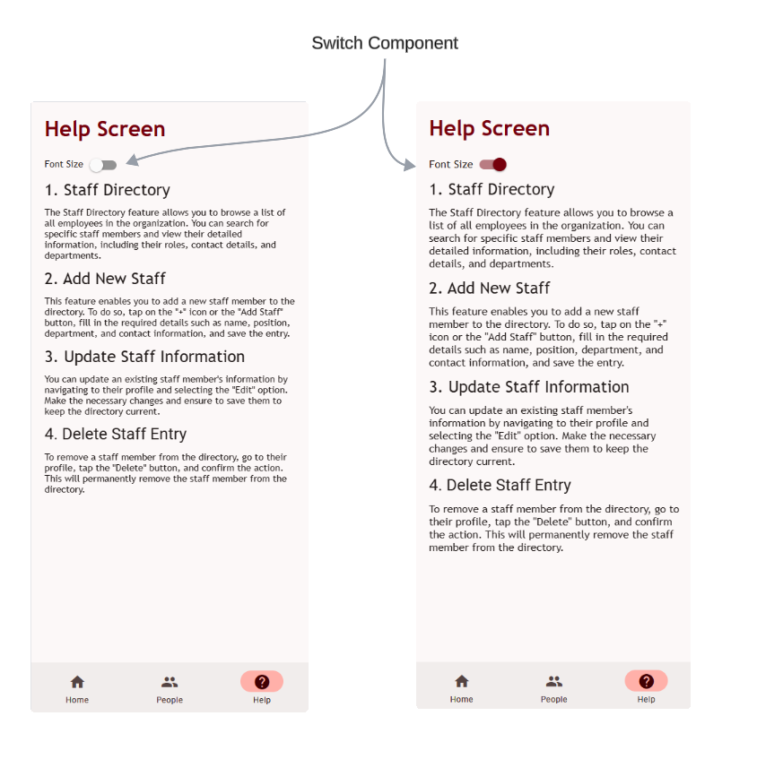

# Configuration

## Configure application settings

This to allow users to configure application settings and output, including text size.

## Implement Font Family

> As it is **required** to use `Trebuchet MS` font in the app, **please update all occurrence** of `<Text/>` component in the **whole application** by using style `style={{ fontFamily: "Trebuchet MS"}}`

## Implement font size switch in Help Screen

- import `Switch` from `react-native-paper`
- Add state named isSwitchOn with default `false` value.
  - `const [isSwitchOn, setIsSwitchOn] = React.useState(false);`
- Add `Switch` component after the Help hading text
  - `<Switch value={isSwitchOn} onValueChange={() => setIsSwitchOn(!isSwitchOn)}/>`
- Add `fontSize: isSwitchOn ? 16 : 14` to all `<Text/>` components in **Help Screen only**



## Help Screen Sample with `Lorem ipsum` text

- Replace `Lorem ipsum` text with your own word to describe the help text

```javascript
export default function HelpScreen(props) {
  const [isSwitchOn, setIsSwitchOn] = React.useState(false);
  theme = useTheme();

  return (
    <Surface elevation={1} style={{ flex: 1, padding: 20 }}>
      <Text
        variant="headlineLarge"
        style={{
          marginBottom: 24,
          fontWeight: "bold",
          color: theme.colors.primary,
          fontFamily: "Trebuchet MS",
        }}
      >
        Help Screen
      </Text>

      <View style={{ flexDirection: "row" }}>
        <Text
          style={{
            fontFamily: "Trebuchet MS",
            fontSize: isSwitchOn ? 16 : 14,
            marginRight: 10,
          }}
        >
          Font Size
        </Text>
        <Switch
          value={isSwitchOn}
          onValueChange={() => setIsSwitchOn(!isSwitchOn)}
        />
      </View>

      <View>
        <Text
          variant="headlineSmall"
          style={{ paddingVertical: 10, fontFamily: "Trebuchet MS" }}
        >
          1. Staff Directory
        </Text>

        <Text
          style={{ fontFamily: "Trebuchet MS", fontSize: isSwitchOn ? 16 : 14 }}
        >
          Lorem ipsum dolor sit amet, consectetur adipiscing elit. Sed do
          eiusmod tempor incididunt ut labore et dolore magna aliqua. Ut enim ad
          minim veniam
        </Text>
      </View>
      <View>
        <Text
          variant="headlineSmall"
          style={{ paddingVertical: 10, fontFamily: "Trebuchet MS" }}
        >
          2. Add New Staff
        </Text>
        <Text
          style={{ fontFamily: "Trebuchet MS", fontSize: isSwitchOn ? 16 : 14 }}
        >
          Lorem ipsum dolor sit amet, consectetur adipiscing elit. Sed do
          eiusmod tempor incididunt ut labore et dolore magna aliqua. Ut enim ad
          minim veniam
        </Text>
      </View>
      <View>
        <Text
          variant="headlineSmall"
          style={{ paddingVertical: 10, fontFamily: "Trebuchet MS" }}
        >
          3. Update Staff Information
        </Text>
        <Text
          style={{ fontFamily: "Trebuchet MS", fontSize: isSwitchOn ? 16 : 14 }}
        >
          Lorem ipsum dolor sit amet, consectetur adipiscing elit. Sed do
          eiusmod tempor incididunt ut labore et dolore magna aliqua. Ut enim ad
          minim veniam
        </Text>
      </View>
      <View>
        <Text variant="headlineSmall" style={{ paddingVertical: 10 }}>
          4. Delete Staff Entry
        </Text>
        <Text
          style={{ fontFamily: "Trebuchet MS", fontSize: isSwitchOn ? 16 : 14 }}
        >
          Lorem ipsum dolor sit amet, consectetur adipiscing elit. Sed do
          eiusmod tempor incididunt ut labore et dolore magna aliqua. Ut enim ad
          minim veniam
        </Text>
      </View>
    </Surface>
  );
}
```

## Home Screen

```javascript
export default function HomeScreen(props) {
  theme = useTheme();

  const imageIndex = {
    logo: require("../assets/images/roi-logo.jpg"),
    mono: require("../assets/images/roi-logo-monochrome.jpg"),
  };

  return (
    <Surface elevation={1} style={{ flex: 1, padding: 20 }}>
      <IconButton
        icon="account-circle-outline"
        mode="contained"
        iconColor={theme.colors.onSecondary}
        size={24}
      />
      <Text
        variant="headlineLarge"
        style={{
          marginBottom: 24,
          fontWeight: "bold",
          color: theme.colors.primary,
        }}
      >
        Hi, John
      </Text>
      <Divider />
      <Image
        source={imageIndex.logo}
        resizeMode="contain"
        style={{ width: "300", height: 150, margin: 20 }}
      />
      <Divider />
      <Text
        variant="headlineLarge"
        style={{
          fontWeight: "bold",
          marginVertical: 10,
          textAlign: "center",
        }}
      >
        ROI HR System
      </Text>
      <Divider />
      <View
        style={{
          flexDirection: "row",
          justifyContent: "space-between",
          alignItems: "center",
          paddingVertical: 10,
        }}
      >
        <Text variant="titleMedium">Remaining Leave Days:</Text>
        <Text>10</Text>
      </View>
      <Divider />
    </Surface>
  );
}
```
