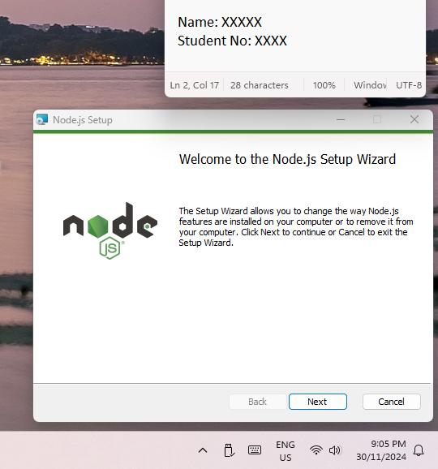
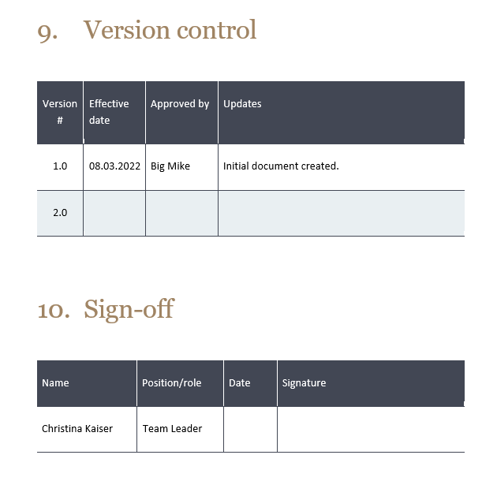

# Submission Requirements

This assessment is in five parts:

1. Development report
2. Application prototype
3. Backend
4. Frontend
5. Video of mobile app demo

## 1. Development report

> **Labelled screenshot:** is a screenshot that include **date** and **time** of the Operating system and a text including your **name** and your **student number** (Part 3 screenshots)

**Development report** should cover:

- Part 1:
  - Include screenshot for each screen (portrait, landscape, resolution w x h) (**from design file "Figma"**).
  - Screenshot of email sent to client to discuss any changes required.
- Part 2:
  - "Define technical UI requirements" showing each screen/view of the app with the relevant info:
    - UI screenshots (Preview of phone & tablet views) (**from running app in chrome**)
    - Functions.
    - Actions.
    - Components.
    - Events.
    - Input/output.
- Part 3: **Labelled screenshots** of setting up and using the VCS (Git + Github + VS Code). Should cover:
  - Setup of IDE (**VS Code**) (2 screenshots, start and end of installation)
  - Config of IDE (**VS Code**) (1 screenshot for setting screen or keyboard shortcuts)
  - Setup of VCS (**Git**) (2 screenshots, start and end of installation)
  - Config of VCS (**Git**) (1 screenshot fro global configuration in terminal)
  - Creating local repo (1 screenshot of `git init` in terminal, better for the whole VS Code)
  - Staging + committing changes (screenshots in terminal for `git add`, `git commit`)
  - Committing at least three code changes (1 Screenshot of 3 commits from the github website of your project)
  - Pushing code to remote repo (screenshot in terminal for `git push`)
  - Handling a pull request (screenshot merging or rejecting).
  - Screenshot of building or testing, it may be a VS Code while running the app with the terminal, and the app running in the chrome
- Part 4: Test checklist for functional testing. Just have basic functional testing of each screen.
  - Should have a table with test cases filled in (ID, test name, requirements detail, pass/fail, screenshots/evidence).
  - Have items for each screen of the app, but don't need to go too in depth.
- Part 5: Screenshot of **email sent** to team member asking for feedback on the "Development report, VCS outcomes and the mobile application and process".
  - **Responded to feedback**.
- Part 5: Include basic instructions on how to install an APK file in an Android emulator (basically drag & drop).

Additional **Notes**:

- **Evidence of sign off**: the development report must include a section for **version control** and **sign off**.
  - **You can use the tables from project 1 template**

- **Student must receive a signature, reply email or similar to indicate product acceptance**.

> The report should include evidence of product acceptance. Students must receive a signature, reply email, or similar confirmation from their supervisor. This means you need to **provide an email from your supervisor to you confirming the development report with a sign-off**.

- Name your file as: `ROI_mobile-app-development-report_<YourName>_<Date>`
- Replace `<YourName>` with your full name and `<Date>` with the submission date.

### Development report checklist

- Part 1
  - Functional Requirements
  - **6** Screenshots (portrait+landscape)
  - **2** prototype email confirmation
- Part 2
  - **6** Screenshots (portrait+landscape)
- Part 3
  - **12** **Labelled** screenshots
- Part 4
  - Test checklist with **6** Screenshots
- Part 5
  - **2** Team member communication email confirmation
- Last part
  - **1 or 2**  email from your supervisor to you confirming the development report with a sign-off.
  - **version control** and **sign off**.

## 2. Application prototype

You need to submit a prototype design file/s that includes the following:

1. Portrait Phone Design
   - A design layout optimized for a mobile phone in **portrait** orientation.
2. Landscape Tablet Design
   - A design layout optimized for a tablet in **landscape** orientation.
3. All App Screens
   - Ensure the prototype includes **all screens** of your application.
4. The page layouts must include specific measurements.

### Important Notes

- **Do not submit a URL**. Only submit a design file.
- Save your Figma design locally by going to:
  - File > Save local copy
  - This will generate a .fig file that can be shared.
- Name your file as: `ROI_mobile-app-design_<YourName>_<Date>`
- Replace `<YourName>` with your full name and `<Date>` with the submission date.

## 3. Backend

You need to submit a ZIP file containing the following:

- A **working** Node.js backend project with a functional web API.
- Name your ZIP file as: `ROI_mobile-app-backend_<YourName>_<Date>`
- Replace `<YourName>` with your full name and `<Date>` with the submission date.

## 4. Frontend

You need to submit a ZIP file containing the following:

- A **working** React Native/Expo project for your mobile application.
- Name your ZIP file as: `ROI_mobile-app-frontend_<YourName>_<Date>`
- Replace `<YourName>` with your full name and `<Date>` with the submission date.

## 5. Video of mobile app demo

You need to submit a video screen recording demonstrating the functionality of your mobile application. The video should showcase that your mobile app is functional, including its various screens and features.

### Functionality to Demonstrate

Ensure the following features are clearly shown in the recording:

1. Home & Help Screens
   - Navigate through the Home and Help screens of your app.
2. Add Person
   - Add a new person by entering your own name and other details.
3. View People
   - Display the list of people, including the newly added person.
4. View Person
   - Show the full details of the newly added person.
5. Edit Person
   - Update the details of the person (e.g., change their data).
6. View People/View Person
   - Display the updated details of the edited person.
7. Delete Person
   - Delete the newly added person.
8. View People
   - Show the list of people to confirm the person has been deleted.

### Recording Conditions

Follow these guidelines for your video:

- The recording should include both audio and video, with the audio in your own voice.
- At the start of the video, introduce yourself by stating:
  - Your name
  - Your student number
  - The date and time of the recording
  - The course and class the project is part of
- Run your mobile application in Google Chrome and demonstrate its functionality.
- Name your video file as `ROI_mobile-app-demo_<YourName>_<Date>`
- Replace `<YourName>` with your full name and `<Date>` with the submission date.
