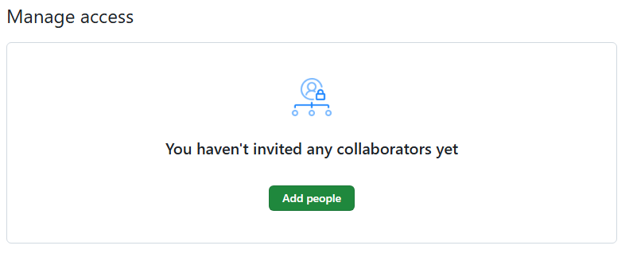

# Pull Request

## What is Pull Requests

A pull request involves submitting code contributions to a project, allowing you to share your work with other developers for review and potential integration.

> GitHub's pull requests enable users to share modifications they've made to a branch in a repository, facilitating collaboration and review. When a pull request is initiated, collaborators can engage in discussions and assess proposed changes before merging them into the main branch. This process allows for iterative refinement and ensures the integrity of the codebase.

## Workflow for a pull request

- Developer creates a new branch from the main project repository.
- Developer makes changes to the code in their branch.
- Developer pushes the changes to their branch on the remote repository (e.g., GitHub).
- Developer opens a pull request, proposing their changes to be merged into the main branch.
- Other developers review the pull request, providing feedback and suggesting improvements.
- Developer makes necessary adjustments based on feedback.
- Once the changes are approved, the pull request is merged into the main branch, incorporating the modifications into the project.

## Exercise

- Install the following extension before you start

### Add a collaborator

- Click on Settings Icon in your repo

- Click on Collaborators

- Click on Add people to add your colleague' github account

- Enter your colleague username, or email

- Click on Add
- Your colleague will receive an email

- You colleague should click on View invitation in the email, then click on Accept invitation

### Create a new branch

- You colleague will clone the repo, and create a new branch
- Click on the branch in statusbar
- Crete a new branch, use your name

- Make an update, push to the github
- You may notice a popup windows on the right corner, asking

- As repo' owner, you will receive an email about the pull request

### Comminate with collaborator

- Open pull request from the activity bar

- From this panel, you can see the pull request under All Open
- You can read the content of the pull request
- You can read the updates
- You can Approve, Request change, or merge

- Or you can do the same acitivity from the repo page

## Links

[About pull requests](https://docs.github.com/en/pull-requests/collaborating-with-pull-requests/proposing-changes-to-your-work-with-pull-requests/about-pull-requests)

[Pull Requests in VS Code (Youtube)](https://www.youtube.com/watch?v=LdSwWxVzUpo&t=161s)
